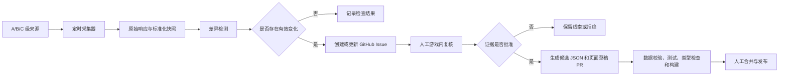

# Unbox ASMR 游戏信息更新监测设计

**日期：** 2026-08-01

**状态：** 已确认，待实施计划

**目标仓库：** `D:\1副业\AI产品\AI网站\8月\游戏-unboxASMR`

## 1. 背景

现有站点已经使用结构化 JSON、证据状态、精确核验日期、`DATA_NEEDED.md`、`noindex` 和构建时数据校验来阻止未经证实的玩法信息进入公开内容。缺少的是持续发现外部变化、保存前后差异、创建人工复核任务，以及在证据获批后生成候选内容更新的工作流。

监测系统的职责是发现变化，不是替代游戏内核验。公开页面、社交渠道和第三方内容都不能自动证明价格、按钮、解锁条件、代码有效性、重生结果或其他游戏内部事实。

## 2. 已确认的公开资源

2026-08-01 通过 Roblox 官方免认证公开接口核对：

- Place ID：`112233638491976`
- Universe ID：`10454554751`
- Creator Group ID：`1110056661`
- Creator Group：`ASMR Labs`
- Place 到 Universe 解析：`https://apis.roblox.com/universes/v1/places/112233638491976/universe`
- 游戏公开详情：`https://games.roblox.com/v1/games?universeIds=10454554751`
- 群组公开详情：`https://groups.roblox.com/v1/groups/1110056661`

这些接口可用于监测公开元数据，但不能读取第三方体验的内部 DataStore、玩法配置或未公开资源。

Roblox Open Cloud API Key 只允许访问密钥所有者有权访问且已授予作用域的资源。本项目不把 Open Cloud 当作第三方游戏内部数据源，也不要求 Roblox Cookie 或 Open Cloud 密钥。

相关官方文档：

- [Roblox Cloud API reference](https://create.roblox.com/docs/cloud)
- [Manage API keys](https://create.roblox.com/docs/cloud/auth/api-keys)
- [Universes API reference](https://create.roblox.com/docs/cloud/reference/features/universes)
- [Webhook notifications](https://create.roblox.com/docs/cloud/webhooks/webhook-notifications)

## 3. 目标

一期系统必须做到：

1. 定时检查已登记的 A、B、C 级公开来源。
2. 保存最近一次成功标准化快照和短期原始响应。
3. 对比可解释的业务字段，而不是直接比较整页 HTML。
4. 发现有效变化时创建或更新去重的 GitHub Issue。
5. 将需要游戏内核验的变化明确标记并附带复核清单。
6. 只有人工批准证据后，才允许生成候选数据修改和草稿 PR。
7. 复用现有数据校验、测试、类型检查、构建和 `noindex` 门槛。

## 4. 非目标

一期不建设：

- 实时监测或独立后台。
- 自动运行 Roblox 游戏客户端或自动游戏操作。
- 使用登录 Cookie 抓取受限 Roblox、Discord 或其他账号内容。
- 解包、泄露、推算或猜测数据采集。
- AI 自动认定事实、自动写成确定性攻略或自动发布。
- 自动合并 PR、自动部署或自动解除 `noindex`。
- Cloudflare Cron、D1 或 KV 监测平台；它们只作为规模扩大后的候选方案。

## 5. 来源分级与使用边界

| 等级 | 来源 | 允许用途 | 禁止用途 |
| --- | --- | --- | --- |
| A | Roblox 游戏公开页面/API、ASMR Labs 群组、官方公告 | 确认公开身份、公告、活动时间及页面明确展示的事实，并记录检查日期 | 推断游戏内部配置或未显示的玩法效果 |
| A | 当前版本游戏内截图或录屏 | 确认价格、按钮、解锁条件、重生提示、兑换结果及其他画面直接证明的事实 | 用裁剪掉关键上下文或版本不明的画面作证 |
| B | 已人工确认归属的官方 Discord、YouTube、社交账号 | 记录预告、维护和发布日期，标记为官方预告 | 在实际上线前写成已实现玩法 |
| C | Wiki、攻略站、视频和玩家讨论 | 创建调查线索或补充明确标记的社区背景 | 自动写成确定事实、覆盖更新的 A 级证据 |
| D | 推算、猜测、解包和泄露 | 不采集、不引用 | 进入 Issue、数据文件或页面内容 |

Discord、YouTube 和社交账号必须由维护者确认归属后才可加入来源注册表。同名账号不能自动认定为官方。

## 6. 方案选择

### 6.1 采用方案：GitHub Actions

使用 GitHub Actions 执行定时和手动监测，通过 GitHub Issue 承载审核队列，并在证据批准后生成草稿 PR。该方案与当前 GitHub 仓库、JSON 数据层和验证命令直接衔接，不引入数据库或长期运行服务。

### 6.2 未采用方案

- Windows 本地计划任务：实现简单，但依赖电脑开机、网络和本地环境，不适合作为持续基线。
- Cloudflare Cron + D1/KV：运行稳定但一期需要额外存储、接口和运维，超出最小范围。

## 7. 总体架构



系统分为六个边界清晰的模块：

1. `source registry`：登记来源等级、地址、频率、解析器、允许用途和影响页面。
2. `collector`：请求公开来源并保存原始响应，不判断事实。
3. `normalizer`：将响应转为稳定、可比较的字段。
4. `diff engine`：产生字段级前后差异并过滤噪声。
5. `triage reporter`：创建或更新去重 Issue，附带证据状态和复核清单。
6. `content promoter`：仅在人工批准后生成候选数据修改和草稿 PR。

各模块通过 JSON 结构通信，采集器不直接修改站点 `data/*.json`，差异检测器不决定证据是否足够，内容晋级器不自动合并或发布。

## 8. 来源注册表

来源注册表必须包含以下字段：

```ts
type MonitorSource = {
  id: string;
  label: string;
  tier: "A" | "B" | "C";
  kind: "roblox_api" | "webpage" | "rss" | "social" | "manual";
  url: string;
  cadence: "twice_daily" | "daily" | "twice_weekly" | "update_window" | "manual";
  parser: string;
  allowedClaims: string[];
  affectedRoutes: string[];
  enabled: boolean;
};
```

一期初始自动来源：

- Roblox Place 到 Universe 的公开解析接口。
- Roblox 游戏公开详情接口。
- ASMR Labs 群组公开详情接口。
- 项目现有并已注明等级的公开辅助来源，默认作为 C 级线索。

游戏内截图或录屏登记为 A 级人工来源，不由监测任务自动采集。

## 9. 调度策略

- Roblox 游戏详情和群组：每天两次，GitHub cron 使用 UTC 时间，对应北京时间约 `09:15` 和 `21:15`。
- 已确认的官方社交来源：每天一次。
- C 级调查来源：每周两次。
- 已登记活动的开始前 12 小时至开始后 24 小时：每小时检查一次。工作流可以每小时触发，但只有进入活动窗口时才运行高频来源。
- 支持 `workflow_dispatch`，允许维护者随时执行完整检查或指定来源检查。

监测频率只代表检查计划。页面仍显示精确 `checkedAt` 或 `verifiedAt`，不得声称“每天更新”。

## 10. 快照和状态存储

- 独立 `monitor-state` 分支保存标准化成功快照，避免给 `main` 产生机器人状态提交。
- 每次运行先读取 `monitor-state` 中对应来源的最近成功快照。
- 只有标准化业务字段变化或检查元数据需要推进时才更新状态分支。
- 原始 HTTP 响应保存为短期 GitHub Actions Artifact，默认保留 30 天。
- 失败响应不得覆盖最近成功快照。
- 如果状态分支不存在，首次运行建立基线并输出摘要，不为已有字段创建虚假“全部新增”Issue。
- 如果状态分支或 Artifact 丢失，任务重新建立基线，并创建 `monitor-health` 警告，而不是猜测历史变化。

状态只保存公开内容、标准化字段、哈希、检查时间、HTTP 状态和解析器版本，不保存账号 Cookie、Token 或个人信息。

## 11. 标准化和差异规则

### 11.1 标准化

- 文本统一换行、空白和 Unicode 表示。
- 删除追踪参数、动态推荐区、无关 HTML 属性和展示顺序噪声。
- 时间统一为 ISO 8601，并保存原始时区信息。
- 列表按稳定业务键排序，不能依赖网页展示顺序。
- 保存解析器版本；版本变化时先生成迁移摘要，避免把解析方式改变误报为来源改变。

### 11.2 创建内容复核 Issue 的变化

- 游戏名称、描述、图标、公开状态或 Creator 信息变化。
- 官方公告新增、删除或正文发生实质变化。
- 活动名称、开始时间或结束时间变化。
- 已登记 Gamepass 名称或公开价格变化；效果仍需游戏内复核。
- B/C 级来源首次出现新的版本、代码、箱子、玩具或玩法关键词。
- 来源连续失败并超过新鲜度期限。

### 11.3 只记录趋势的变化

- 在线人数、访问量和收藏数的常规波动。
- 评分、访问量等公开指标仅在结构异常、显著回退或不可访问时进入健康 Issue，不能证明玩法更新。
- `playing` 只记录趋势；连续三次成功响应均为 `0` 且游戏仍标记为公开时，创建健康 Issue。
- 累计型 `visits` 或 `favoritedCount` 相比最近成功快照下降超过 1% 时，创建健康 Issue；增长不创建内容复核 Issue。
- 阈值只控制监测健康告警，不控制页面事实，也不用于推断游戏更新。

### 11.4 忽略的噪声

- 页面广告、推荐模块和 HTML 属性顺序变化。
- 空格、标点格式、时间展示格式和追踪参数变化。
- 同一 C 级消息的重复转载。

## 12. Issue 审核队列

有效变化创建或更新一个去重 Issue。去重键为 `source id + change topic`，同一主题后续变化追加评论，不重复开新 Issue。

Issue 必须包含：

- 发现时间和检查时间。
- 来源等级、来源地址和当前可用性。
- 受影响站内页面和数据文件。
- 字段级变更前后内容。
- 自动判断的边界说明。
- 当前审核状态。
- 游戏内复核清单。
- 关联的 Artifact、后续 PR 和最终处理结论。

推荐标签：

- `monitor-change`
- `source-A`、`source-B`、`source-C`
- `needs-triage`
- `needs-in-game-verification`
- `evidence-approved`
- `evidence-rejected`
- `monitor-health`
- `parser-broken`

典型 Issue 正文：

```text
[Monitor][A] Roblox game description changed

发现时间：
来源等级：A
检查地址：
影响页面：/updates/, /codes/
变更前：
变更后：
自动判断：官方公开描述发生变化，具体玩法尚未在游戏内验证
当前状态：needs_in_game_verification

复核清单：
[ ] 保存当前版本游戏内截图或录屏
[ ] 核实价格、按钮和解锁条件
[ ] 隐去用户名和聊天内容
[ ] 填写 verifiedAt 和游戏版本
[ ] 更新对应 JSON 和 changelog
[ ] 运行数据校验、测试、类型检查和构建
```

## 13. 人工复核和证据晋级

状态流转：

```text
detected
→ triaged
→ needs_in_game_verification
→ evidence_approved / evidence_rejected
→ pr_open
→ published
→ recheck_due
```

规则：

1. A 级官方公开来源可以证明其直接展示的公开事实，但涉及实际玩法效果时仍进入游戏内复核。
2. B 级内容只能晋级为“官方预告”，不能在上线前写成已实现内容。
3. C 级内容只能产生调查任务或明确标记的社区背景，不能直接修改确定性事实。
4. D 级内容不能进入审核队列。
5. 正式游戏内证据必须可确认当前版本，并保留证明目标字段所需的完整 UI 上下文。
6. 用户名、聊天和无关个人信息必须在进入仓库前裁剪。
7. 只有维护者添加 `evidence-approved` 标签后，内容晋级器才可运行。
8. `evidence-approved` 之前，维护者必须在 Issue 的 `Approved payload` 区块明确填写目标数据文件、允许修改的 JSON 字段、证据状态、`verifiedAt`、游戏版本和证据位置。内容晋级器只验证和应用这份结构化载荷，不从截图或自然语言中自动推理字段值。

## 14. 内容晋级和草稿 PR

内容晋级器由 `evidence-approved` 标签或手动工作流触发，且必须再次确认 Issue 含有可追溯证据。

它只允许：

- 修改证据直接覆盖的 `data/*.json` 字段。
- 填写精确 `checkedAt`、`verifiedAt`、游戏版本、活动名和来源。
- 更新 `data/changelog.json`。
- 必要时更新受影响页面中的日期、状态和明确事实。
- 生成草稿 PR，列出证据、影响页面和验证结果。

它不得：

- 根据单条证据生成“最佳”“值得买”“完整列表”等扩大性结论。
- 自动移除 `noindex`。PR 可以提出移除建议，但必须由人工确认页面已完成独立玩家任务后手工批准。
- 修改无关页面、合并 PR、部署或发布。

草稿 PR 必须运行现有的：

```text
npm test
npm run lint
npm run typecheck
npm run build
```

其中 `npm run build` 继续执行现有 `validate:data` 门槛。

## 15. 失败处理

- `429`、超时和 `5xx` 使用指数退避，最多重试三次。
- 单个来源失败时其他来源继续执行，整次任务标记为部分成功。
- 同一来源连续三次失败时创建或更新 `monitor-health` Issue。
- 页面结构改变、必需字段缺失或解析结果异常为空时标记 `parser-broken`，空结果不能被当作内容删除。
- 官方页面返回 `404` 时创建高优先级 Issue，但不自动删除网站已有内容。
- 状态更新失败时保留主流程产生的 Artifact 和运行摘要，不声称基线已推进。
- Issue 或 PR 写入权限不足时，工作流失败并明确报告所需 GitHub 权限，不吞掉变化结果。
- 所有时间和失败信息使用绝对时间戳，避免“刚刚”“最近”等模糊表达。

## 16. 安全、隐私和成本

- 公共 Roblox 来源不需要 Open Cloud API Key。
- 监测工作流使用 `contents: write` 和 `issues: write`：内容写权限只用于 `monitor-state` 分支，`main` 通过分支保护阻止机器人直接写入。
- 内容晋级工作流独立申请 `contents: write`、`pull-requests: write` 和 `issues: read`，只允许创建候选分支和草稿 PR。
- 两类工作流都不得获得部署环境、Cloudflare 或 Roblox 账号权限。
- 不保存 Roblox Cookie、Discord Token、个人凭据或未经授权的账号内容。
- 不自动下载玩家头像、聊天记录或个人主页数据。
- 原始游戏内截图由人工处理，隐私裁剪后才可进入内容分支。
- 一期不调用大模型，运行成本限于 GitHub Actions 和公开 HTTP 请求。
- 若以后加入模型摘要，模型输出只能作为草稿，必须保留原始差异并经过人工复核。

## 17. 测试设计

### 17.1 单元测试

- 来源注册表字段、等级和允许用途校验。
- Roblox 游戏详情和群组固定样本解析。
- 文本、时间、URL 和列表标准化。
- 字段级差异、噪声过滤和趋势阈值。
- Issue 去重键和状态转换。
- B/C 级信息无法直接晋级为确定性事实。
- 缺少游戏内证据时，代码有效性、玩法效果和重生信息不能晋级。

### 17.2 集成测试

- 首次运行只建立基线，不误报所有字段新增。
- 官方描述变化创建一个 Issue，并包含前后差异。
- 重复运行更新同一 Issue，不创建副本。
- 采集失败保留上一份成功快照。
- 解析器返回异常空内容时产生 `parser-broken`。
- 未添加 `evidence-approved` 标签时，内容晋级工作流拒绝运行。
- 审批后的固定证据样本可以生成草稿 PR 候选修改。

### 17.3 仓库验证

任何生成的候选内容修改必须通过数据校验、现有单元测试、lint、TypeScript 检查和 Next.js 构建。监测模块的失败不得绕过站点既有验证门槛。

## 18. MVP 验收标准

满足以下全部条件才算一期完成：

1. 定时运行和 `workflow_dispatch` 手动运行均成功。
2. 首次运行建立已核对 ID 的公开基线，不创建虚假变化 Issue。
3. 模拟官方描述变化时只创建一个包含前后差异的 Issue。
4. 在线人数的常规变化不创建内容复核 Issue。
5. C 级来源出现新代码时只生成待游戏内验证任务，不修改 `data/codes.json`。
6. 来源失败时保留上一份成功数据并产生可见健康告警。
7. 页面结构变化不会把空解析结果当作真实删除。
8. 未添加 `evidence-approved` 标签时不能生成内容 PR。
9. 审核通过后可以生成草稿 PR，并通过现有项目检查。
10. 自动化过程不会自动合并、部署、移除 `noindex` 或发布未经复核的事实。

## 19. 分期实施

### MVP

- 来源注册表。
- Roblox 游戏公开详情、Place/Universe 一致性和群组采集器。
- 标准化快照、`monitor-state` 分支和短期 Artifact。
- 差异检测、GitHub Issue 去重和健康告警。
- 固定样本测试、手动运行和每日调度。

### P1

- 加入已确认归属的官方 Discord、YouTube 和社交来源。
- 加入 C 级调查来源和活动窗口高频调度。
- 增加来源新鲜度报告。

### P2

- `evidence-approved` 审核触发。
- 候选 JSON、changelog 和必要页面修改。
- 草稿 PR、验证摘要和发布后重新检查任务。

每个阶段都必须保持“自动发现、人工确认、构建拦截”的边界。

## 20. 成功指标

一期上线后的前四周记录：

- 定时工作流成功率不低于 95%。
- 有效来源变化在下一次计划运行内进入 Issue。
- 同一变化的重复 Issue 数为 0。
- C 级线索直接进入确定性内容的次数为 0。
- 未经 `evidence-approved` 生成内容 PR 的次数为 0。
- 采集或解析失败导致成功基线被错误覆盖的次数为 0。

这些指标评价监测和审核流程，不构成“网站每天更新”的公开承诺。
